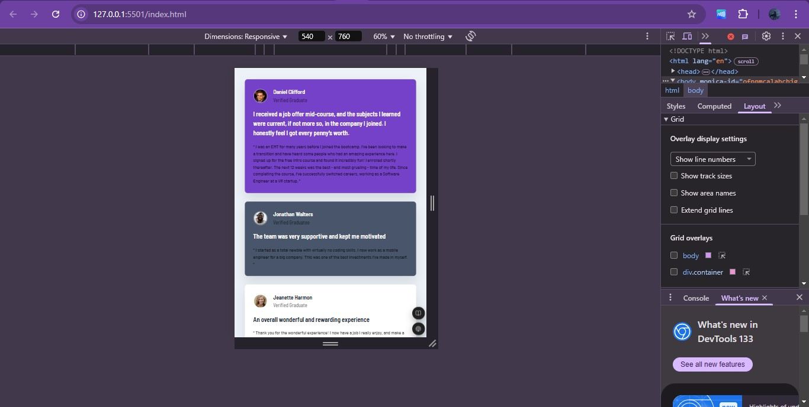
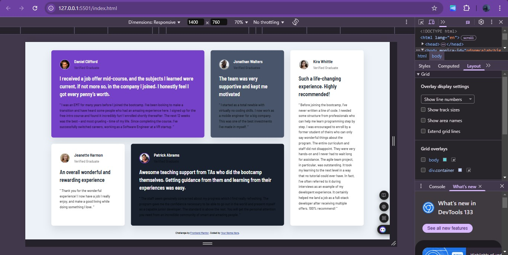

# Frontend Mentor - Testimonials grid section solution

This is a solution to the [Testimonials grid section challenge on Frontend Mentor](https://www.frontendmentor.io/challenges/testimonials-grid-section-Nnw6J7Un7). Frontend Mentor challenges help you improve your coding skills by building realistic projects. 

## Table of contents

- [Overview](#overview)
  - [The challenge](#the-challenge)
  - [Screenshot](#screenshot)
  - [Links](#links)
- [My process](#my-process)
  - [Built with](#built-with)
  - [What I learned](#what-i-learned)
  - [Useful resources](#useful-resources)
- [Author](#author)

**Note: Delete this note and update the table of contents based on what sections you keep.**

## Overview

### The challenge

Users should be able to:

- View the optimal layout for the site depending on their device's screen size

### Screenshot

Above are the screenshots of my code

### Links

- Solution URL: [GitHub Link]()
- Live Site URL: [Live Site](https://grid-section-testimonials.vercel.app/)

## My process

### Built with

- Semantic HTML5 markup
- CSS custom properties
- Flexbox
- CSS Grid
- Mobile-first workflow

### What I learned

Honestly I learnt a lot, took me a lot of time to actually finish this. It was annoying, painful and quite difficult to understand. The use of grids is a little new to me and I would need constant practice to get better at it, especially grid responsiveness.

### Useful resources

- [Travis Horn](https://travishorn.com/responsive-grid-in-2-minutes-with-css-grid-layout-4842a41420fe) - This helped me to better uderstand grid responsiveness
- [W3 Schools](https://www.w3schools.com/Css/css_rwd_grid.asp) - Ulthoug I didn't use this method it was a great help.

## Author

- Frontend Mentor - [@Othniel-Nduka](https://www.frontendmentor.io/profile/yourusername)
- Twitter - [@MeisAnanymouss](https://x.com/MeisAnanymouss)

